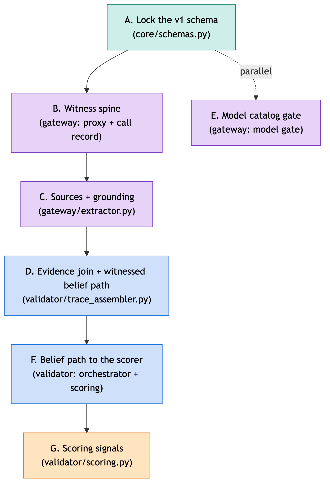
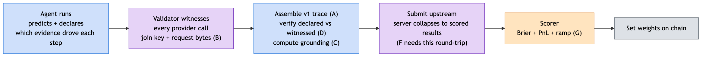

# v1 trace + scoring roadmap

The trace we emit today is still the old v0.1 shape, and it does not yet support the scoring we actually want: rewarding an agent that moves toward the truth early, and proving that the evidence it cited is what drove the move. This is the plan to get there. Seven areas, A through G, mostly in sequence with the model gate off to the side.

## What is blocking us

1. **The belief path is not witnessed.** Real varying paths already show up in traces (an agent going `0.50 → 0.19 → 0.10 → 0.12` as evidence comes in), but those numbers are self-reported. Nothing parses the per-step probability from the model's own output, so we cannot trust them for scoring.
2. **The evidence-to-reasoning link is fake.** Reasoning steps are supposed to point at the call and sources that drove them. Today the assembler fills that link positionally, writing call indices into the evidence slot, so the link is true by construction and proves nothing.
3. **The saved trace is off the scoring path.** The scorer reads a flattened prediction, not the trace, so the reasoning and belief path never reach it. Even the market price we grade against is read from a side channel, outside the sealed trace.

**Goal:** close these three so we can score the probability path end to end, and verify each move against what the validator actually witnessed. Here is the lifecycle we are wiring up:

## Work areas

### A. Lock the v1 trace schema
*The schema lives in `core/schemas.py`. Everything else builds on this, so it goes first.*

Today the trace records sources twice, carries several fields that are null across the entire corpus, uses a sprawling set of reasoning-step types, and keeps the scored market price outside the hashed trace. The v1 shape fixes that:

- One typed `Source` in `sources_accessed[]` holding url, title, excerpt, and a computed `counts_toward_grounding` flag. Drop the parallel evidence array that duplicated it.
- Collapse the reasoning-step vocabulary to three values (`prior`, `belief_update`, `gap_query`) and drop the step fields that are null everywhere.
- Add a slot to store chain-of-thought when a model exposes it. Stored for diagnostics, never scored.
- Stamp the validator-written market price into the trace, so the number a miner is graded against sits inside the hashed artifact rather than in a side channel.
- Bump the version so emitted traces actually claim v1, and validate a hand-built sample against the schema before anything downstream builds on it.

### B. Harden the witness spine
*The gateway's witness layer: the local proxy and the record it builds for each provider call.*

The validator already witnesses every call (it assigns a call index and hashes the response), but it throws away the request that produced the call and stamps no key to tie a later reasoning step back to a specific call. Two small additions fix that: keep the verbatim request bytes, and stamp a correlation key on each call at witness time. The response hash we already keep becomes the byte-match fallback. These two fields are load-bearing, the join (D) and grounding (C) both depend on them, but this area changes no scoring on its own.

### C. Single source home + computed grounding
*In `gateway/extractor.py`.*

Right now only one provider's sources get parsed into the typed list; the rest land in a second place, so the same URLs are recorded twice. And grounding is rubber-stamped true on everything. The fix: route every provider's sources into the single typed list and drop the duplicate. Then mark a source as grounding only when its content actually appears in a later reasoning prompt, checked against the request bytes from B. Where a provider returns a title but no snippet, fall back to a title or url match, or default to false, rather than claiming grounding we cannot show.

### D. Declared-to-verified evidence join + witnessed belief path
*The assembler in `validator/trace_assembler.py`, plus the per-step probability parse in the extractor. The largest piece, and it depends on A, B, C.*

This is the core of the rework: turning the trace from a self-report into an audit.

- Parse the per-step probability from the model's own output, so the belief path is witnessed rather than asserted by the agent.
- Have the agent declare, in its structured output, which call and which sources drove each step. The validator verifies each declaration against what it witnessed, correlation key first, byte-match on the response hash as the fallback, and writes a verified reference or an honest blank when it cannot confirm.
- Point evidence refs at the linked call's source list, not at call indices, so the link means something.
- Handle both code paths that produce traces today, since they emit slightly different shapes and the fix has to cover both.

### E. Model catalog gate
*The model gate in the gateway. Independent of D, so it can land in parallel.*

There is no catalog check anywhere today; whatever model the agent names gets used. Enforce the safe constants now (they already hold across the corpus), and add the model allow-list behind a flag. Do not flip the allow-list to hard enforcement until it is frozen: live agents run models that are not on it yet (a reasoning model, a small cheap model, an online-search variant), and enforcing early would reject them.

### F. Put the belief path on the scoring path
*Spans `validator/orchestrator_api.py` and `scoring.py`.*

The scorer reads a flat prediction and never touches the trace. The rich reasoning is submitted upstream and collapsed to a single number before scoring sees it, and the market baseline is read from a side channel. This area carries the belief path, the verified refs, and the market price through the collapse into the scorer's record. The catch: the collapse happens on the server, so this lands the validator-side plumbing, but the server has to round-trip the fields back before scoring sees real data (see gated).

### G. Scoring signals
*In `validator/scoring.py`. Staged, so v1 stays simple.*

Accuracy today is graded against a fixed baseline, so two miners nailing an easy event both get full marks, and the belief path is unused. The direction:

- **v1 is simple and forgiving**, so a new miner can start earning immediately with no requirement to emit a belief path or grounding. Core is endpoint accuracy (Brier) plus a market-relative term (a PnL-style edge against the market price, so agreeing with the crowd pays close to nothing). New miners ramp in from a floor rather than being zeroed.
- **The richer signals come later.** Rewarding early moves along the witnessed path turns on at low weight and ramps up as the miner base grows. Every weight change ships behind an off-switch defaulting to today's behaviour.

## Build order

1. **Schema (A)** first, so there is a fixed contract to build against.
2. **Witness spine (B)** next: the request bytes and correlation key are the load-bearing fields everything downstream needs.
3. **Sources and grounding (C)**, now that B gives us the prompt bytes to check against.
4. **The join (D)**, the big one, once A, B, C are in place.
5. **Catalog gate (E)** in parallel with D; it only depends on A.
6. **Scoring plumbing (F)**: carry the belief path, refs, and market price to the scorer.
7. **Scoring signals (G)** last, since it depends on F.

Ship as one branch, one commit per area in that order, so the history reads as the build.

## Needs sign-off / gated

- **End-to-end belief-path scoring depends on the server.** The trace is collapsed to a single number before it reaches scoring, so the server has to carry the belief path and market price back on the scored results. That part is out of this repo; F lands the validator side, but the round-trip has to exist for it to see real data.
- **Freeze the model allow-list before enforcing it.** Live agents use models not on the list yet, so flipping enforcement on would reject them. Keep it behind a flag until the list is settled.
- **The scoring change shifts how emissions are distributed.** That is an economics decision, not just code, so it needs sign-off. Ship behind an off-switch defaulting to today's behaviour, and measure each signal's effect in isolation.

## Loose ends to watch

- **Re-hashing.** The trace hash changes shape once we drop fields, so already-emitted traces need a versioning or migration story.
- **Grounding coverage is partial.** Some providers return a per-source snippet and some do not, so grounding is only computable where that content exists. Pick the fallback explicitly.
- **Two live paths.** Traces today can come out of either of two code paths that emit slightly different shapes, so any fix has to handle both.
