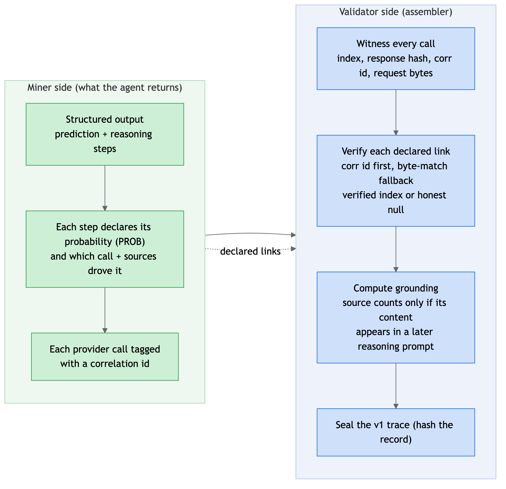

# The v1 trace: schema, miner contract, and validator assembly

The trace is the artifact we score and the data we keep, so its shape is the thing to get right. v1 draws a clean line through it: what the **miner declares** (its reasoning, which is self-reported and forgeable) versus what the **validator witnesses** (the actual provider calls, which the agent cannot fake). The assembler joins the two and trusts only what it witnessed.

<p align="center"></p>

## The two halves

- **Witnessed.** The validator sits on every provider call the agent makes. For each one it records a call index, hashes the raw response, stamps the correlation id the agent sent, and keeps the request bytes. None of this comes from the agent's claims, so none of it can be faked.
- **Declared.** The agent's own reasoning chain: each step, its probability, and which evidence it used. This is self-reported, so it has to be checked before it can be scored.

The assembler's whole job is to bind each declared step to the witnessed call behind it, and write either a verified link or an honest blank.

## What changes in the schema

The trace is a versioned JSON record, defined in `core/schemas.py`. The v1 shape, trimmed to the load-bearing parts:

```json
{
  "trace_schema_version": "1.0.0",
  "execution_context": {
    "run_id": "…",
    "market_price_at_prediction": 0.485
  },
  "provider_calls": [
    {
      "call_index": 2,
      "provider_id": "openrouter",
      "call_type": "chat_completion",
      "model": "perplexity/sonar-pro",
      "correlation_id": "c2",
      "raw_response_hash": "sha256:…",
      "request_text": "…the prompt that was sent…",
      "cost_units": 0.006,
      "sources_accessed": [
        { "url": "https://…", "title": "…", "excerpt": "…", "counts_toward_grounding": true }
      ],
      "reasoning_capture": { "available": false }
    }
  ],
  "reasoning_chain": [
    {
      "step_index": 1,
      "step_type": "belief_update",
      "reasoning_text": "…",
      "intermediate_probability": 0.19,
      "provider_call_index": 2,
      "input_evidence_refs": [0, 3]
    }
  ],
  "prediction_output": {
    "probability": 0.12,
    "reasoning_summary": "…",
    "contrarian_flag": true
  },
  "trace_integrity": { "trace_hash": "sha256:…", "usage_totals": { "total_tokens": 8400 } },
  "resolution_record": null
}
```

What moved relative to the old v0.1 trace:

- **Sources have one home.** Each provider call carries a typed `sources_accessed[]`, each source with url, title, excerpt, and a computed `counts_toward_grounding` flag. The parallel evidence array that recorded the same URLs a second time is gone.
- **Reasoning steps are typed and carry a probability.** Three step types (`prior`, `belief_update`, `gap_query`) replace the old sprawling set, and every step carries an `intermediate_probability`, so the belief path is first-class rather than buried.
- **Provider calls carry what the join needs.** A `correlation_id`, the `request_text` bytes, and the `raw_response_hash`. The request bytes do double duty: they are the byte-match fallback when a correlation id is missing, and they are what grounding checks against (did a source's content actually appear in a later prompt). Provider and call type are pinned to constants, and the model is checked against the catalog. There is also an optional `reasoning_capture` slot to hold chain-of-thought when a model exposes it, kept for diagnostics and never scored, since verbalized reasoning is not reliably faithful to what the model actually did.
- **The scored price sits inside the trace.** `market_price_at_prediction` is stamped into `execution_context`, so the baseline a miner is graded against is inside the hashed record rather than read from a side channel.
- **Dead and duplicated fields are dropped**, and the version is bumped so an emitted trace actually claims v1.

## Miner side: what the agent returns

The agent contract stays small. Subclass the base agent, implement `predict`, and return a structured, validated result. The only new obligation is that each reasoning step declares where it came from:

```python
class ReasoningStep(BaseModel):
    step_type: Literal["prior", "belief_update", "gap_query"]
    reasoning_text: str
    intermediate_probability: float     # the step's PROB, its belief at this point
    used_call: str | None               # correlation id of the call that fed it
    used_sources: list[int]             # which sources from that call it used

class AgentResult(BaseModel):
    probability: float
    reasoning_summary: str
    steps: list[ReasoningStep]
```

Two small things make the declared half verifiable:

- The agent tags each provider call it makes with a correlation id (passed through the call context), so the validator can match a declared step to the specific call it witnessed.
- Each step states its probability, so the belief path (for example `0.50 → 0.19 → 0.10 → 0.12`) is explicit rather than something we have to infer.

Declaring the links and probabilities is what unlocks the belief-path and evidence scoring. A miner that returns only a prediction still runs; its declared links just come back blank in the trace.

## Validator side: how the assembler builds the trace

The assembly lives in `validator/trace_assembler.py`, fed by the gateway's witness layer. Four steps:

1. **Witness.** As the agent runs in the sandbox, the gateway proxy witnesses every provider call: it assigns the next call index, hashes the raw response, stamps the correlation id the agent sent, and stores the request bytes. This is the ground truth everything else is checked against.

2. **Verify.** For each declared step, the assembler finds the witnessed call whose correlation id matches the one the agent declared. If the id is missing, it falls back to matching on the response hash. On a match it writes the verified `provider_call_index` and translates the step's source references into indices in that call's `sources_accessed[]`. On no match it writes `null`, an honest blank rather than a fabricated link.

3. **Ground.** For each source, set `counts_toward_grounding` to true only when the source's content actually appears in a later reasoning call's request text. Where a provider returns a title but no snippet, fall back to a weaker match or leave it false, rather than claiming grounding we cannot show.

4. **Seal.** Hash the whole record into `trace_hash`.

This is the step that turns the trace from a self-report into an audit. The belief path becomes witnessed because the step probability is parsed from the model's own output, and every evidence link is either verified against a witnessed call or left honestly blank.

## The join, in one place

The old assembler filled the evidence link positionally, writing call indices into the evidence slot, so the link was true by construction and proved nothing. v1 replaces that with declare-then-verify:

- **Primary:** match the correlation id the agent stamped on its call to the id the validator recorded when it witnessed that call.
- **Fallback:** if the id is missing, match on the response hash the validator already keeps.
- **Result:** a verified `provider_call_index`, or `null` when nothing matches. And `input_evidence_refs` points into the linked call's `sources_accessed[]`, not at call indices, so the reference actually names sources.

## Worked example: one step, verified

Take the Hormuz run. The agent runs a `sonar` search as its second provider call, tags that call with correlation id `c2`, reads the results, and moves its belief to 0.19. In its structured output the `belief_update` step declares `used_call: "c2"`, `used_sources: [0, 3]`, and `intermediate_probability: 0.19`.

On the validator side, that same call was witnessed as `call_index: 2`, carrying `correlation_id: "c2"`, and its response was hashed. The assembler matches `c2`, so it writes `provider_call_index: 2` on the step and rewrites the source references as indices into call 2's `sources_accessed[]`. The step is now backed by a call the validator actually saw, not by the agent's word.

Grounding runs on top of the same witnessed data. Source 0 on call 2 has an excerpt. If that excerpt text shows up in the request bytes of the next reasoning call (call 3, where the model reasons over the search results), the assembler sets `counts_toward_grounding: true`. If the agent cited a source it never actually fed into a prompt, the excerpt will not appear downstream and the flag stays false, so a decorative citation earns no grounding.

The failure case is just as important. If the step had declared `used_call: "c9"` for a call that was never witnessed, the match fails and the step's `provider_call_index` is written as `null`. The trace keeps the agent's claim but marks it unverified, rather than inventing a link to make the reasoning look grounded.

## What still depends on others

- The `market_price_at_prediction` and the belief path reach the scorer only if the server round-trips them, because the trace is collapsed server-side before scoring sees it. The trace side is complete here; the server has to carry the fields back.
- The model allow-list is enforced only once it is frozen, since live agents currently run models that are not on it yet.
